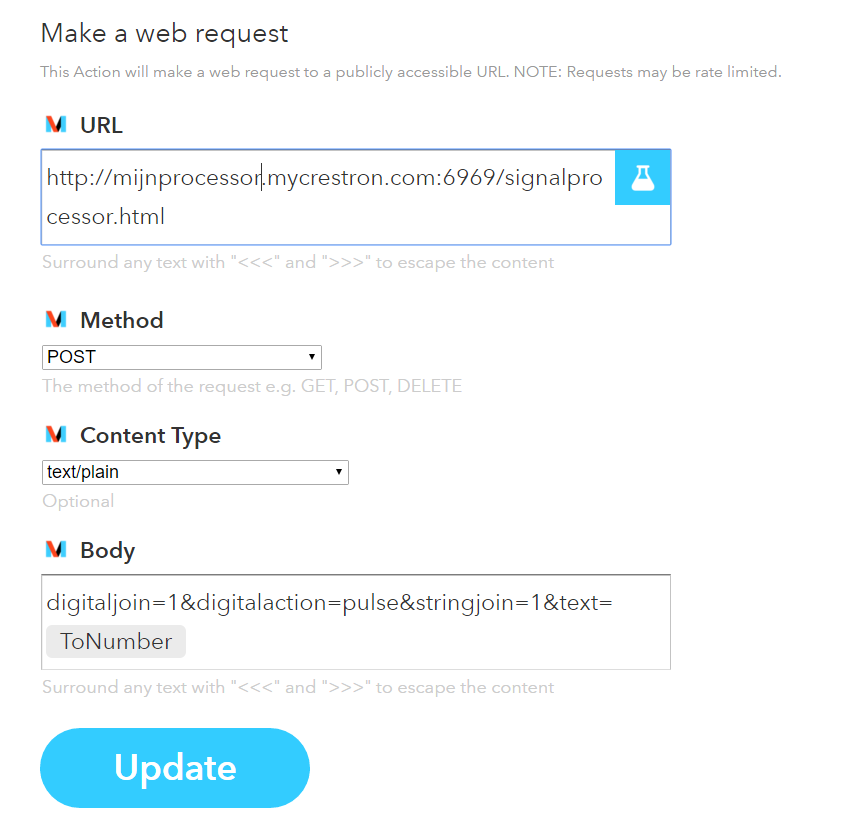

## httpToSignal server for SIMPL# Crestron

This module has been created to make it easy for services that have an http client API to send data to a Crestron control systems. The module implements an http (api) interface to send data to SIMPL Windows.

## Code Example

Inside the SIMPL folder you will find a complete example program that can be used to start playing with the module. The module will accept one digital and/or one serial join change per http request. 

## Motivation

This project was created as a quick and easy link from IFTTT to a Crestron System. 

## How to use the http API
URL to be used:  
http://<IP/hostname>:<listeningPort>/signalprocessor.html  
Variables need to be included in the body/content part of the http request: 
digitaljoin=1&digitalaction=pulse&stringjoin=1&text={{YouCanUseTagsToSendData}}

Example how you can set up IFTT to use this this interface: 

